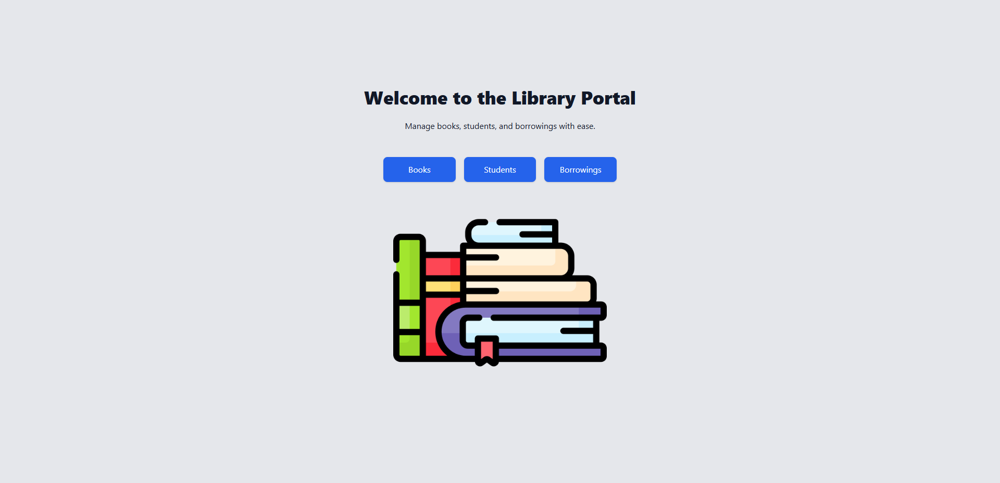
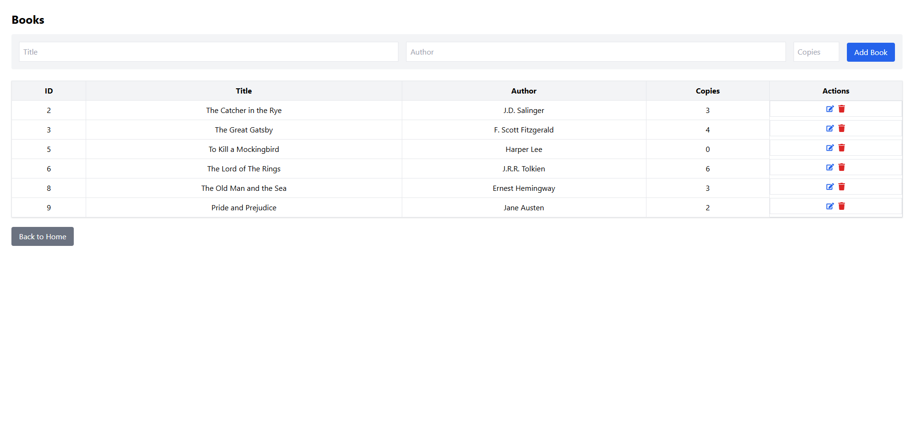
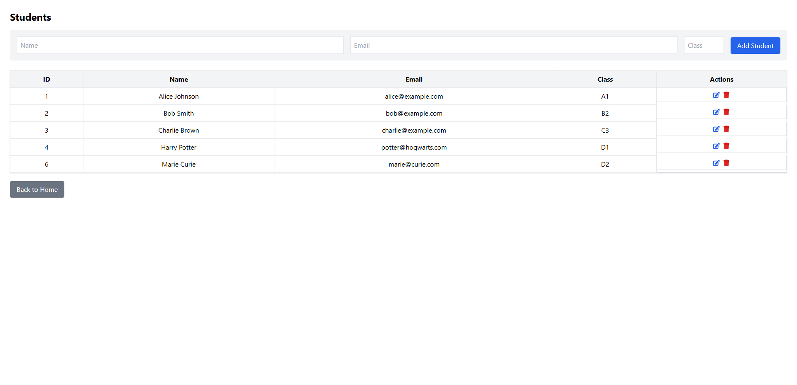
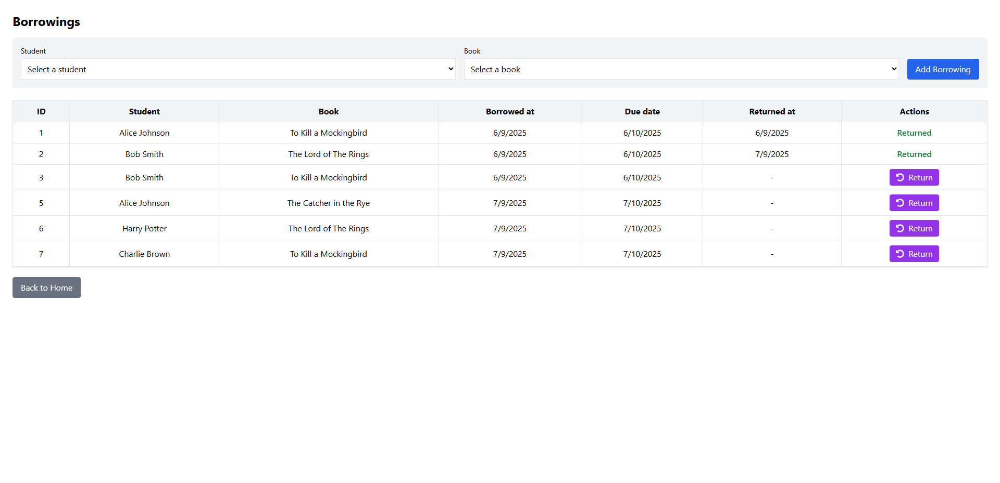

# 📚 Library Portal

A **full-stack web application** for managing a library system.  
Built with **React (Vite + Tailwind)** on the frontend and **Express + SQLite** on the backend.  

It allows users to:
- Manage **Books** (create, edit, delete, view)
- Manage **Students**
- Handle **Borrowings** with rules:
  - Max 3 active borrowings per student
  - 30-day due dates
  - Automatic update of book copies

---

## 🚀 Tech Stack
- **Frontend:** React, Vite, TailwindCSS  
- **Backend:** Node.js, Express  
- **Database:** SQLite  

---

## ⚙️ Installation & Setup

### 1. Clone the repository
```bash
git clone https://github.com/your-username/library-portal.git
cd library-portal
```

### 2. Start the backend
```bash
cd backend
npm install
node server.js
```
👉 Runs on [http://localhost:3001](http://localhost:3001)

### 3. Start the frontend
```bash
cd ../frontend
npm install
npm run dev
```
👉 Runs on [http://localhost:5173](http://localhost:5173)

### 4. Environment Variables
Create a `.env` file inside `frontend/` with:
```ini
VITE_API_URL=http://localhost:3001
```

---

## 📸 Preview



 

---

## 📝 Note
This project was developed as part of a technical assessment.  
It is intended solely for demonstration purposes.
